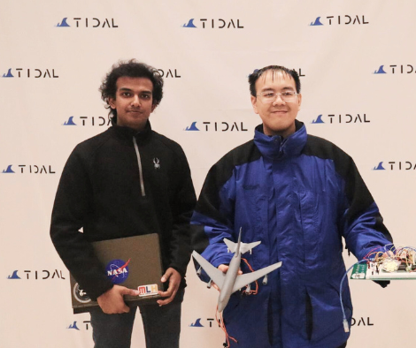
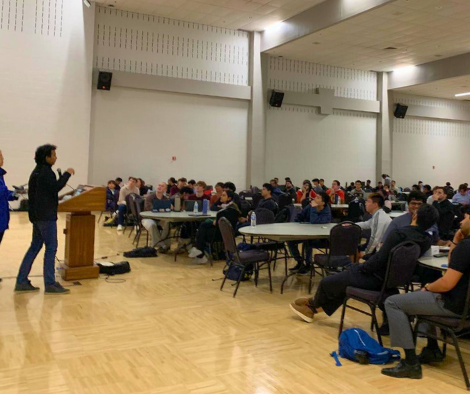

# Flight Guardian AI
**TIDAL HACK (TAMU) - Major League Hackathon [MLH] 2025** **||WINNER||**

***US PATENT PENDING: 63/752,795***

Judged by: 
- Google
- AWS
- Microsoft Azure
- Texas A&M Professors

 

DATA USED: 
- US Airways flight 1549 (Miracle on the Hudson)
- NTSB investigation Report link: https://www.ntsb.gov/investigations/Pages/DCA09MA026.aspx
- FDR used from NTSB Docket: https://data.ntsb.gov/Docket/?NTSBNumber=DCA09MA026

ATC Recording from YouTube [used as CVR]

***All data used are publicly available on NTSB website***

## Inspiration
This project was inspired by the tragedy of Flight MH370, where many lives were lost, and the critical question of **"How?"** and **"Where?"** remain unanswered. This led me to dive into numerous air crash investigation documentaries and study several NTSB and FAA accident reports related to commercial aviation.

While analyzing these reports, I noticed a major issue—flight data is typically examined only after an accident occurred, rather than in **real-time** to prevent or mitigate incidents. This realization sparked a breakthrough: leveraging AI to detect anomalies in both Flight Data and Cockpit Voice recordings as they happen.

By enabling AI models to interpret in-flight events in real-time, Flight Guardian AI aims to be a crucial communication bridge between aircraft, ATC, airline operations, and federal authorities. In moments of crisis, our system can instantly report incidents and stream critical data to the necessary parties, potentially **saving lives** and **transforming aviation safety**.

## What it does
Flight Guardian AI enables real-time analysis of Flight Data and Cockpit Voice recordings, providing critical insights to enhance aviation safety. By continuously monitoring in-flight data, the system can detect anomalies immediately, allowing pilots, ground crews, and authorities to respond swiftly to potential emergencies.

Beyond real-time monitoring, the system also enables proactive safety measures by identifying risks before an incident happens, ensuring a higher level of flight safety. Flight Guardian AI operates on three core principles: ‘Detect,’ ‘Analyze,’ and ‘Stream’—using AI to detect irregularities, analyze potential threats, and stream critical data to the appropriate authorities for informed decision-making.

## How we built it
For the Cockpit Voice Recorder (CVR) analysis, we utilized AWS Transcribe to generate transcriptions, perform speaker diarization, and detect potential toxicity in cockpit communications. Additionally, AWS Comprehend was used to conduct sentiment analysis, helping assess the emotional state and tone of conversations within the cockpit. Once diarization was completed using AWS services, we leveraged Gemini 1.5 Pro to prioritize key flight data parameters, ensuring a targeted and efficient analysis.

What This Analysis Reveals:
1. Detects possible cockpit intrusions
2. Ensures the cockpit environment remains neutral and professional
3. Verifies adherence to standard operating procedures (SOPs)
4. Identifies and flags emergency situations in real time

For the Flight Data Recorder (FDR), we processed over 200 flight parameters in real time, providing a comprehensive view of aircraft performance and potential anomalies. By correlating CVR insights with FDR data, the AI model can focus on specific parameters relevant to the detected cockpit situation, leading to a more precise and effective response.

What It Does:
This system enables the real-time streaming of flight data to the appropriate authorities, offering a more detailed picture of in-cockpit events. Rather than relying solely on standard communication data such as Heading, Altitude, and Speed, Flight Guardian AI provides deeper insights into cockpit conditions, enhancing situational awareness and decision-making.

## Challenges we ran into
One of the major challenges we encountered was the lack of real-time flight data, as most available datasets were based on post-incident flight data. This made it difficult to develop and test our system in live environments, limiting our ability to perform real-time analysis. Additionally, we faced difficulties obtaining sufficient Cockpit Voice Recorder (CVR) data due to privacy and security restrictions, which hindered our ability to train AI models for sentiment analysis and anomaly detection in the cockpit. Despite these challenges, we were able to work with the available datasets and leverage innovative AI solutions to overcome these data limitations and continue developing Flight Guardian AI.

## Accomplishments that we're proud of
1. **Real-Time CVR & FDR Analysis:** Successfully integrated AI models to analyze Cockpit Voice Recorder (CVR) and Flight Data Recorder (FDR) data in real-time, enabling instant anomaly detection.
2. **Seamless Multi-Service Integration:** Leveraged AWS Transcribe, AWS Comprehend, and Gemini 1.5 Pro to transcribe, analyze sentiment, and prioritize critical flight parameters—creating a first-of-its-kind AI-driven aviation safety system.
3.  **AI-Driven Emergency Detection:** Developed an AI pipeline capable of detecting cockpit intrusions, SOP violations, and emergency situations using voice sentiment and data-driven insights.
4. **Proactive Safety Overhaul:** Shifted aviation safety from post-incident analysis to proactive risk detection, potentially preventing accidents before they occur.
5. **Live Data Streaming to Authorities:** Created a system that instantly streams flight data and cockpit insights to ATC, airline operations, and federal authorities, ensuring rapid response during critical situations.

## What we learned
1. **The Critical Gaps in Aviation Safety:** Traditional flight data analysis occurs after an incident, but real-time AI monitoring can bridge this gap and provide proactive safety measures.
2. **The Power of AI in Aviation:** By integrating AWS Transcribe, AWS Comprehend, and Gemini 1.5 Pro, we saw how AI can interpret both voice and flight data to detect anomalies that humans might overlook.

This journey has given us a deeper understanding of AI’s potential in aviation and the immense impact it can have on preventing accidents and saving lives.

## What's next for Flight Guardian AI
1. **Build a Prototype:** Develop a fully functional prototype to demonstrate real-time analysis and streaming of flight data and cockpit voice recordings.
2. **Obtain Certification:** Achieve supplementary certification to test Flight Guardian AI on actual aircraft, ensuring compliance and reliability.
3. **Commercialize:** Scale and sell Flight Guardian AI to airlines and aviation organizations, setting a new standard for in-flight safety monitoring.
